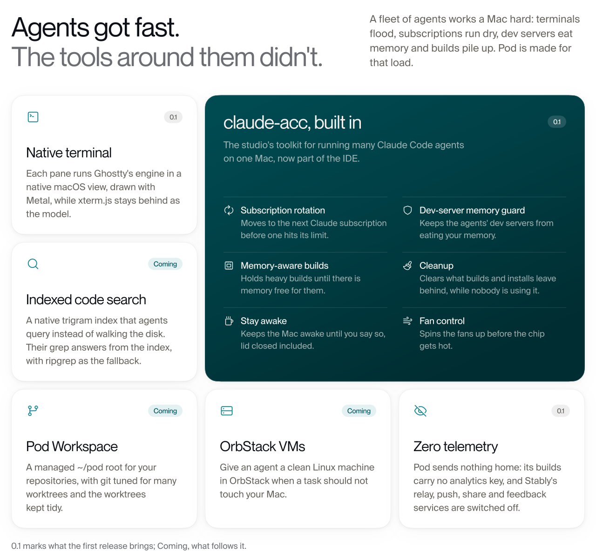
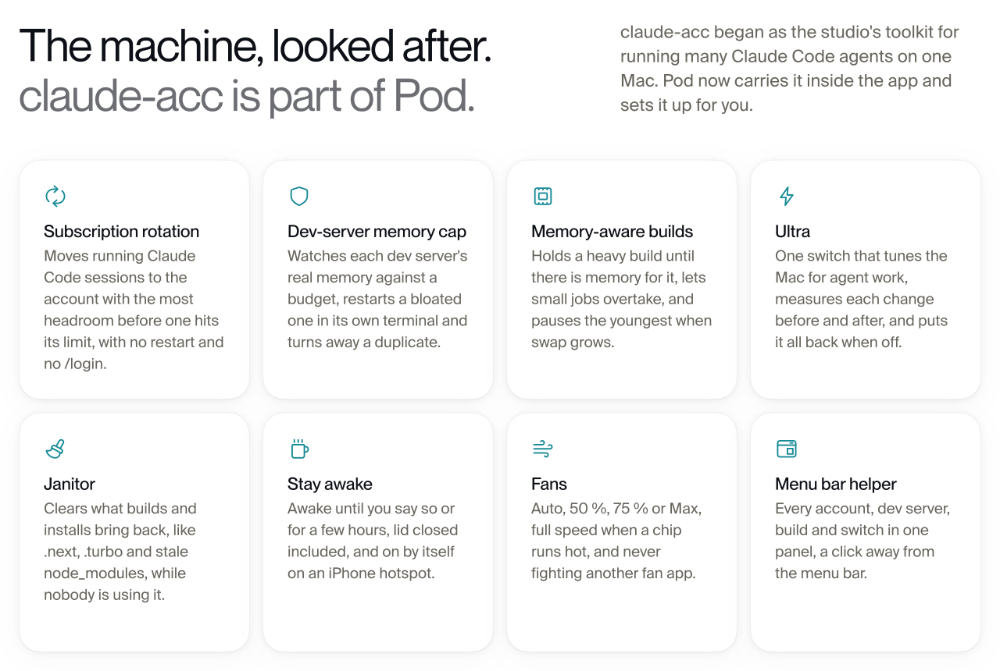
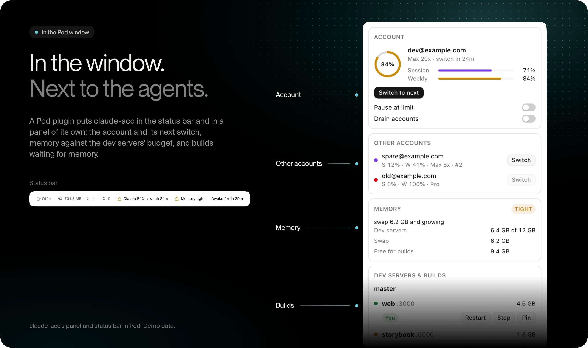
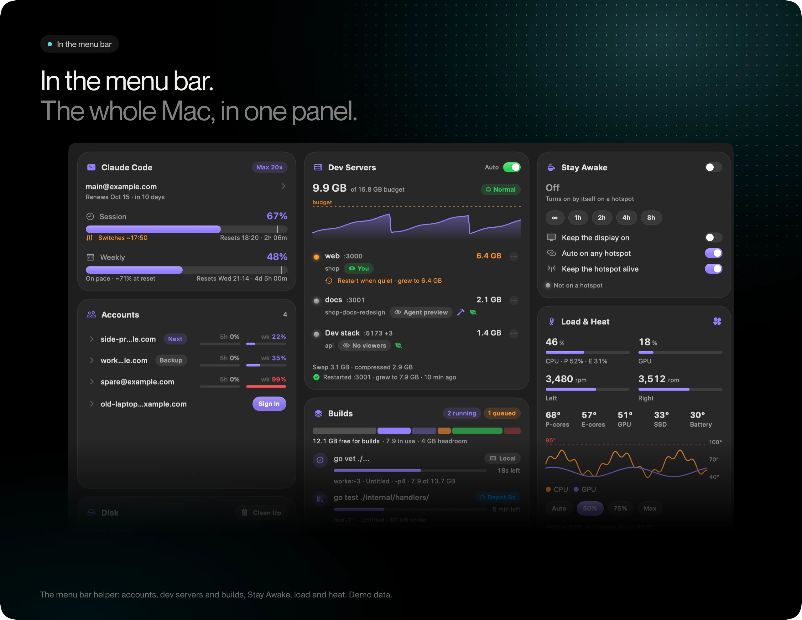
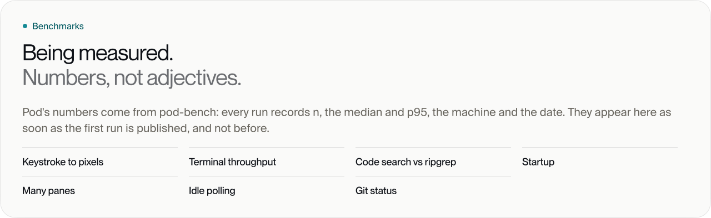

<!--
  Pod's README. Every image is built by .github/assets/src (build.py for the pictures, bench.py
  for the charts, from pod-bench's summary.json). Fonts are outlined into the SVGs; no font file
  is in this repository. Each picture has a dark and a light variant, and a narrow one for phones.
-->

<picture>
  <source media="(prefers-color-scheme: dark) and (max-width: 600px)" srcset="assets/hero-narrow-dark.svg">
  <source media="(max-width: 600px)" srcset="assets/hero-narrow-light.svg">
  <source media="(prefers-color-scheme: dark)" srcset="assets/hero-dark.svg">
  
</picture>

<p align="center">
  <a href="https://github.com/outof-place/pod/releases/latest"><picture><source media="(prefers-color-scheme: dark)" srcset="assets/button-download-dark.svg"></picture></a>
  <a href="https://github.com/outof-place/homebrew-tap"><picture><source media="(prefers-color-scheme: dark)" srcset="assets/button-brew-dark.svg"></picture></a>
  <a href="https://pod.codes"><picture><source media="(prefers-color-scheme: dark)" srcset="assets/button-site-dark.svg"></picture></a>
</p>

<p align="center">
  <a href="../LICENSE"></a>
  <a href="../upstream.json"></a>
  
  <a href="https://github.com/stablyai/orca/pulls?q=is%3Apr+author%3Aoutof-place"></a>
</p>

```sh
brew install --cask outof-place/tap/pod
```

> [!NOTE]
> Pod is early. The signed, notarized DMG and the Homebrew cask arrive with the first release;
> until then, [build from source](#build-from-source). The [changelog](../CHANGELOG.md) lists what has shipped.

<picture>
  <source media="(prefers-color-scheme: dark) and (max-width: 600px)" srcset="assets/window-narrow-dark.svg">
  <source media="(max-width: 600px)" srcset="assets/window-narrow-light.svg">
  <source media="(prefers-color-scheme: dark)" srcset="assets/window-dark.svg">
  
</picture>

<p align="center"><sub>An illustration of the Pod window. Screenshots arrive with the first release.</sub></p>

## Why Pod

<picture>
  <source media="(prefers-color-scheme: dark) and (max-width: 600px)" srcset="assets/why-narrow-dark.svg">
  <source media="(max-width: 600px)" srcset="assets/why-narrow-light.svg">
  <source media="(prefers-color-scheme: dark)" srcset="assets/why-dark.svg">
  
</picture>

<details>
<summary>The same, as text</summary>

- **Native terminal** (0.1). Each pane runs Ghostty's engine in a native macOS view, drawn with
  Metal, while xterm.js stays behind as the model.
- **claude-acc, built in** (0.1). Subscription rotation, a dev-server memory guard, memory-aware
  builds, cleanup, stay awake (lid closed included) and fan control. [More below](#claude-acc-built-in).
- **Indexed code search** (coming). A native trigram index that agents query instead of walking the
  disk, with ripgrep as the fallback.
- **Pod Workspace** (coming). A managed `~/pod` root for your repositories, with git tuned for many
  worktrees and the worktrees kept tidy.
- **OrbStack VMs** (coming). A clean Linux machine for a task that should not touch your Mac.
- **Zero telemetry** (0.1). Pod sends no telemetry and makes no calls to Stably services.

0.1 marks what the first release brings; coming, what follows it. Per-worktree setup through
`orca.yaml` is inherited from Orca.

</details>

## claude-acc, built in

[claude-acc](https://github.com/outof-place/claude-acc), the studio's menu bar control room for a Mac
that runs Claude Code agents all day, is now part of Pod. Pod carries it inside the app from the first
release and sets it up for you, so the subscriptions, the memory, the builds and the Mac itself are
looked after while the agents work.

<picture>
  <source media="(prefers-color-scheme: dark) and (max-width: 600px)" srcset="assets/acc-features-narrow-dark.svg">
  <source media="(max-width: 600px)" srcset="assets/acc-features-narrow-light.svg">
  <source media="(prefers-color-scheme: dark)" srcset="assets/acc-features-dark.svg">
  
</picture>

<picture>
  <source media="(max-width: 600px)" srcset="assets/acc-window-narrow.webp">
  
</picture>

<picture>
  <source media="(max-width: 600px)" srcset="assets/acc-menu-narrow.webp">
  
</picture>

### Measured

<!-- bench:claude-acc:start -->
<sub>claude-acc's numbers come from pod-bench's claude-acc group. Fresh runs are drawn solid; figures measured before Pod are hatched and carry their date and source. Being collected.</sub>
<!-- bench:claude-acc:end -->

### How it fits into Pod

<picture>
  <source media="(prefers-color-scheme: dark) and (max-width: 600px)" srcset="assets/arch-acc-narrow-dark.svg">
  <source media="(max-width: 600px)" srcset="assets/arch-acc-narrow-light.svg">
  <source media="(prefers-color-scheme: dark)" srcset="assets/arch-acc-dark.svg">
  
</picture>

- Pod carries a pinned claude-acc release inside the app; the build checks its sha256.
- On launch, Pod's supervisor runs the bundled `setup.sh --owner pod`, and only when the version, the
  owner or the app's path has changed. Setup installs the LaunchAgents (subscription rotation, the
  dev-server memory guard, cleanup, perf) and the menu helper.
- A Pod plugin shows claude-acc's state in the status bar and a panel, from the state files the jobs write.
- Agents' commands pass a hook that sends dev servers through the memory guard and builds through the
  memory-aware scheduler.
- Fans, and staying awake with the lid closed, run as root daemons that you install separately with
  Touch ID. Pod's setup doesn't install them.
- **First release:** the supervisor, setup and the plugin, with claude-acc's own menu helper,
  LaunchAgents and root daemons as they ship today.
- **Planned, after the first release** (the dashed layer): Claude Acc.app moves inside Pod as
  `Pod Menu.app`, a login item that keeps its bundle id so its permissions carry over; the jobs move to
  LaunchAgents inside Pod.app (`codes.pod.app.acc.*`) on an embedded, pinned Python; and one root
  helper, `pod-rootd`, reached over XPC with fixed verbs, replaces the separate root daemons.

## Benchmarks

Every figure here comes from a pod-bench run, with its n, median, p95, machine and date, and the
caveats the run recorded. The charts round to three figures; the table under them keeps every
digit. How it is measured: [bench/README.md](../bench/README.md).

<!-- bench:start -->
<picture>
  <source media="(prefers-color-scheme: dark) and (max-width: 600px)" srcset="assets/bench-pending-narrow-dark.svg">
  <source media="(max-width: 600px)" srcset="assets/bench-pending-narrow-light.svg">
  <source media="(prefers-color-scheme: dark)" srcset="assets/bench-pending-dark.svg">
  
</picture>
<!-- bench:end -->

## How it works

### The native terminal

<picture>
  <source media="(prefers-color-scheme: dark) and (max-width: 600px)" srcset="assets/arch-terminal-narrow-dark.svg">
  <source media="(max-width: 600px)" srcset="assets/arch-terminal-narrow-light.svg">
  <source media="(prefers-color-scheme: dark)" srcset="assets/arch-terminal-dark.svg">
  
</picture>

- The PTY stays in Orca's terminal daemon, and its output reaches the renderer as it always has.
  There, xterm.js parses every byte and answers the terminal's queries, so replay and search keep
  their existing code.
- A mirror passes the parsed bytes to Pod's native host, an N-API addon in Objective-C++
  (`ghostty_terminal.node`) that links libghostty from GhosttyKit. Ghostty replays them into an
  `NSView` per pane, drawn with Metal, above Chromium's own view.
- When a pane moves or resizes, the renderer sends its rectangle on the next frame, with the holes
  that menus need, so a popover still shows over a native pane.
- Keys go the other way: Ghostty encodes them, and main and the renderer pass them on as `pty:write`.
- Experimental and macOS only. It goes upstream as [stablyai/orca#26914](https://github.com/stablyai/orca/pull/26914).

### Code search for agents

<picture>
  <source media="(prefers-color-scheme: dark) and (max-width: 600px)" srcset="assets/arch-search-narrow-dark.svg">
  <source media="(max-width: 600px)" srcset="assets/arch-search-narrow-light.svg">
  <source media="(prefers-color-scheme: dark)" srcset="assets/arch-search-dark.svg">
  
</picture>

- `og` is a fork of ripgrep 15.2 and takes the same arguments. It asks `ogd` for candidate files over
  a unix socket, then reads their contents straight from the memory-mapped pack. On any error, or
  after 2 s, it runs the real `rg` instead.
- `ogd` runs once per user. It indexes a worktree on its first query and keeps it current from
  FSEvents, with a barrier on every query, so an answer never misses a write.
- The store is kept per git common dir and holds each blob once, so a repository's worktrees share it.
- Pod's own quick open and text search use the same daemon.
- In development; not in a release yet.

## Compared

Pod is built on Orca, so the two share most of each row; the terminal and telemetry cells are where
Pod differs. Every cell links to its source. As of 2026-10-09.

**The agent workflow**

| | Integrated terminal | Parallel agents in worktrees | Agent CLIs | Usage telemetry |
| --- | --- | --- | --- | --- |
| **Pod** | [Ghostty on Metal, in a native view](https://github.com/stablyai/orca/pull/26914) (experimental), or Orca's xterm.js | [Yes, from Orca](https://github.com/stablyai/orca/blob/b8a055435744c3391107f058a03536678c34ecdf/README.md#L51) | [Any CLI agent, from Orca](https://github.com/stablyai/orca/blob/b8a055435744c3391107f058a03536678c34ecdf/README.md#L171-L210) | [None, and no calls to Stably services (0.1)](https://github.com/stablyai/orca/blob/b8a055435744c3391107f058a03536678c34ecdf/src/main/telemetry/client.ts#L21-L36) |
| **Orca** | [xterm.js, WebGL renderer](https://github.com/stablyai/orca/blob/b8a055435744c3391107f058a03536678c34ecdf/package.json#L266-L274) | [Yes](https://github.com/stablyai/orca/blob/b8a055435744c3391107f058a03536678c34ecdf/README.md#L51) | [Any CLI agent](https://github.com/stablyai/orca/blob/b8a055435744c3391107f058a03536678c34ecdf/README.md#L171-L210) | [Anonymous usage events in official builds, opt-out](https://github.com/stablyai/orca/blob/b8a055435744c3391107f058a03536678c34ecdf/src/main/telemetry/client.ts#L21-L36) |
| **Conductor** | [xterm.js, DOM renderer](https://www.conductor.build/changelog/0.49.0-conductor-allegro-gpt-5-5) | [Yes](https://www.conductor.build/docs/concepts/git-worktrees) | [Claude Code, Codex, Cursor, OpenCode](https://www.conductor.build/docs/reference/harnesses) | [PostHog analytics; default not documented](https://www.conductor.build/docs/account/privacy) |
| **Claude Squad** | [Your own terminal, a tmux session per agent](https://github.com/smtg-ai/claude-squad/blob/main/README.md) | [Yes](https://github.com/smtg-ai/claude-squad/blob/main/README.md) | [Claude Code, Codex, Gemini, Aider and others](https://github.com/smtg-ai/claude-squad/blob/main/README.md) | [None found in its source](https://github.com/smtg-ai/claude-squad/blob/main/go.mod) |
| **Cursor** | [VS Code's terminal (xterm.js)](https://cursor.com/docs/configuration/migrations/vscode) | [Yes, in the Agents Window](https://cursor.com/docs/configuration/worktrees) | [Cursor's own agent](https://cursor.com/docs/agent/agents-window) | [Usage data, per its privacy policy](https://cursor.com/privacy) |
| **VS Code** + Copilot | [xterm.js, WebGL renderer](https://github.com/microsoft/vscode/blob/main/package.json#L136-L145) | [Yes, with "New Worktree"](https://code.visualstudio.com/docs/agents/run/agent-harnesses) | [Copilot, Claude, Codex](https://code.visualstudio.com/docs/agents/run/agent-harnesses) | [On by default, opt-out](https://github.com/microsoft/vscode/blob/main/src/vs/platform/telemetry/common/telemetryService.ts#L321-L331) |
| **Zed** | [Native GPU (GPUI) on alacritty_terminal](https://github.com/zed-industries/zed/blob/main/crates/terminal/Cargo.toml#L24) | [Yes, per thread](https://zed.dev/docs/ai/parallel-agents) | [Zed's agent, plus Claude, Codex, Gemini CLI and others over ACP](https://zed.dev/docs/ai/external-agents) | [On by default, opt-out](https://github.com/zed-industries/zed/blob/main/assets/settings/default.json#L1702-L1710) |
| **Warp** | [Its own Rust renderer, Metal on macOS](https://github.com/warpdotdev/warp/blob/main/crates/warpui/Cargo.toml) | [Partly: it detects worktrees you create](https://docs.warp.dev/code/git-worktrees/) | [Warp's agent, plus 16 CLI agents](https://docs.warp.dev/agents/cli-agents/overview/) | [On by default, opt-out](https://docs.warp.dev/terminal/settings/all-settings/) |

**The basics**

| | License | Platforms | Price |
| --- | --- | --- | --- |
| **Pod** | [MIT](../LICENSE) | [macOS](#build-from-source) | [Free](../LICENSE) |
| **Orca** | [MIT](https://github.com/stablyai/orca/blob/main/LICENSE) | [macOS, Windows, Linux](https://github.com/stablyai/orca/blob/b8a055435744c3391107f058a03536678c34ecdf/README.md) | [Free](https://www.onorca.dev/) |
| **Conductor** | [Proprietary](https://www.conductor.build/terms) | [macOS](https://www.conductor.build/docs/installation) | [Free tier; Pro $50/mo](https://www.conductor.build/pricing) |
| **Claude Squad** | [AGPL-3.0](https://github.com/smtg-ai/claude-squad/blob/main/LICENSE.md) | [macOS, Linux and Windows builds; needs tmux](https://github.com/smtg-ai/claude-squad/blob/main/.goreleaser.yaml) | [Free](https://github.com/smtg-ai/claude-squad) |
| **Cursor** | [Proprietary](https://cursor.com/terms-of-service) | [macOS, Windows, Linux](https://cursor.com/downloads) | [Free tier; from $20/mo](https://cursor.com/pricing) |
| **VS Code** + Copilot | [MIT source; the product under a Microsoft license](https://code.visualstudio.com/license) | [macOS, Windows, Linux](https://code.visualstudio.com/download) | [Free; Copilot from $0 to $100/mo](https://github.com/features/copilot/plans) |
| **Zed** | [GPL-3.0-or-later, Apache-2.0 parts](https://github.com/zed-industries/zed/blob/main/README.md) | [macOS, Linux, Windows](https://github.com/zed-industries/zed/blob/main/README.md) | [Free; Pro $10/mo](https://zed.dev/pricing) |
| **Warp** | [AGPL-3.0 client, MIT UI framework](https://github.com/warpdotdev/warp/blob/main/README.md#licensing) | [macOS, Linux, Windows](https://www.warp.dev/pricing) | [Free plan; Build $20/mo](https://www.warp.dev/pricing) |

What Pod adds to Orca, in short: the native Ghostty terminal, claude-acc, no telemetry and macOS-first
packaging in the first release, then indexed search for agents, Pod Workspace and OrbStack VMs. Everything generic goes back to
Orca as a pull request (below). Spotted a cell that is out of date?
[Open an issue](https://github.com/outof-place/pod/issues) and we'll fix it.

## Relationship to Orca

Pod is a downstream macOS distribution of [Orca](https://github.com/stablyai/orca) by Stably AI,
released under the MIT license. Orca does the heavy lifting. Pod is the newest commit on Orca's
`main` that passed Orca's own CI, plus a short, linear stack of patches that adds:

- the native Ghostty terminal and other macOS-only work;
- the Pod identity: name, icon, bundle id `codes.pod.app`, `pod://` links and the `podx` CLI;
- no telemetry, and no calls to Stably services;
- claude-acc built in (in progress);
- its own signed builds and update feed.

### What we send upstream

Anything generic goes to Orca as a pull request first. Status updates live:

| Orca pull request | Change | Status |
| --- | --- | --- |
| [#26914](https://github.com/stablyai/orca/pull/26914) | Experimental native Ghostty terminal view on macOS |  |
| [#26927](https://github.com/stablyai/orca/pull/26927) | Name Multipass recipe VMs and emit an SSH connection |  |
| [#26945](https://github.com/stablyai/orca/pull/26945) | Build the Computer Use helper with Swift 6.4's default build system |  |
| [#26953](https://github.com/stablyai/orca/pull/26953) | Status bar items and live panel messaging for plugins |  |
| [#26956](https://github.com/stablyai/orca/pull/26956) | Keep xterm parse barriers, and the output behind them, across a resize |  |
| [#26973](https://github.com/stablyai/orca/pull/26973) | Derive the bundle id from one runtime constant |  |
| [#26975](https://github.com/stablyai/orca/pull/26975) | Plugin manifest platforms field and an official publisher allowlist |  |
| [#26979](https://github.com/stablyai/orca/pull/26979) | Let Git's untracked cache answer status polls |  |
| [#26985](https://github.com/stablyai/orca/pull/26985) | Read pane process info from the macOS kernel instead of forking ps |  |
| [#26991](https://github.com/stablyai/orca/pull/26991) | Plugin settings pages in Settings |  |

All of them: [pull requests from outof-place on stablyai/orca](https://github.com/stablyai/orca/pulls?q=is%3Apr+author%3Aoutof-place).

### Upstream first

- A change that would help Orca users goes to Orca as a pull request before, or alongside, Pod.
- Pod carries a patch only until it lands on Orca's `main`, then drops it on the next rebase.
- Only Pod's identity, packaging, update feed and product decisions stay fork-only.
- Every commit on `main` says which kind it is, in a trailer:
  `Upstream: <Orca pull request URL>` or `Fork-only: <reason>`.

### Where to report bugs

1. Reproduce the problem on the official [Orca](https://onorca.dev) build first.
2. If it happens there too, it is an Orca bug: report it to
   [stablyai/orca](https://github.com/stablyai/orca/issues). Please don't send Pod reports to the Orca team.
3. If it happens only in Pod, open an issue [here](https://github.com/outof-place/pod/issues).
4. Report security problems privately through
   [a security advisory](https://github.com/outof-place/pod/security/advisories/new), not in a public issue.

Pod is not affiliated with or endorsed by Stably AI or Lovecast Inc. Orca is their trademark.

## Versions

- Pod tracks Orca's `main`, not its releases. Every Pod build sits on one Orca `main` commit whose
  GitHub Actions checks all passed.
- [`upstream.json`](../upstream.json) records that commit, its date and the nearest Orca release
  tag. Pod's release notes use the tag as the "Based on Orca vX" label.
- A daily job moves Pod to the newest green Orca commit. It runs the typecheck, the unit tests and
  the macOS build, then opens a pull request, or one tracking issue when the rebase needs a hand.
- We aim to ship Orca's security fixes in Pod within 48 hours of the fix landing on Orca's `main`.

| Branch | What it is |
| --- | --- |
| `main` (default) | The product: a green Orca `main` commit plus the Pod stack. |
| `orca-main` | An untouched mirror of Orca's `main`, updated daily. |
| `feat/*`, `fix/*`, `perf/*` and other Orca-style names | One branch per Orca pull request. |
| `pod/*` | Pod-only work, one branch per change. |
| `sync/orca-main` | The next rebase, prepared by the sync job and waiting for review. |

## Build from source

You need macOS with the Xcode command line tools, Node 24, and the pnpm version pinned in
`package.json` (`corepack enable` installs it). Tests also need the Bun version in
`config/.bun-version`.

```sh
git clone https://github.com/outof-place/pod.git
cd pod
corepack enable
pnpm install
pnpm dev            # run from source
pnpm build:unpack   # build an unsigned, unpacked app
```

Orca's [contributing guide](CONTRIBUTING.md) covers the toolchain in depth; all of it applies to Pod.

## Contributing

Read [CONTRIBUTING.md](../CONTRIBUTING.md) first. The short version: if your change would help every
Orca user, it belongs in [Orca](https://github.com/stablyai/orca), and Pod picks it up from there.

## License

MIT. See [LICENSE](../LICENSE).

- Copyright (c) 2026 Lovecast Inc. (Orca)
- Copyright (c) 2026 Outofplace Poland sp. z o.o. (Pod's changes)

## Credits

- [Orca](https://github.com/stablyai/orca) by Stably AI (Lovecast Inc.), MIT: the app Pod is built on.
- [Ghostty](https://github.com/ghostty-org/ghostty) by Mitchell Hashimoto and contributors, MIT:
  the terminal engine behind the native terminal view.
- [libghostty-spm](https://github.com/Lakr233/libghostty-spm) by Lakr233, MIT: the prebuilt
  GhosttyKit framework Pod links.
- [Electron](https://www.electronjs.org), [xterm.js](https://xtermjs.org) and every other
  open-source package listed in `package.json`.
- README type: Neue Montreal (Pangram Pangram) and Suisse Intl (Swiss Typefaces), outlined in the
  images under the studio's licenses; terminal text in [JetBrains Mono](https://github.com/JetBrains/JetBrainsMono) (OFL).

Made by [outofplace](https://outofplace.space).
